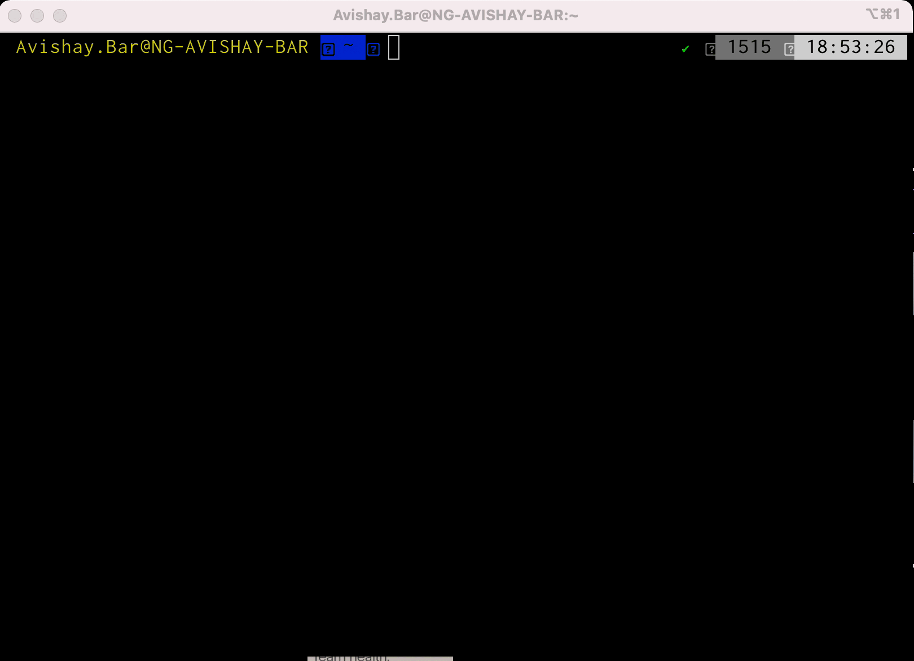
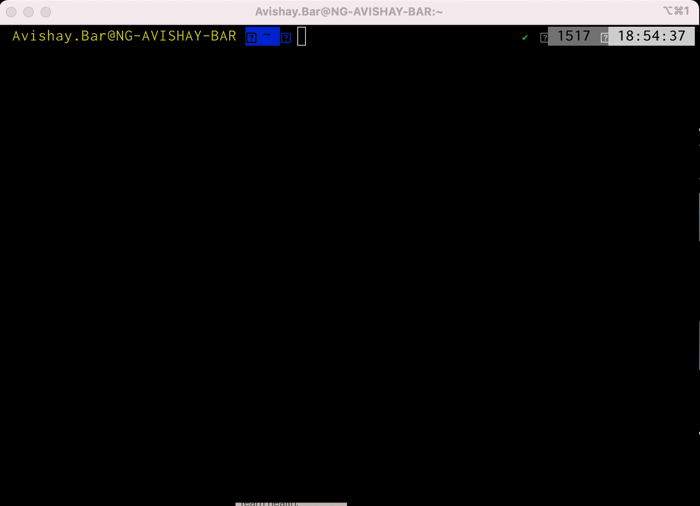

==========
Secure EC2
==========

.. image:: https://img.shields.io/pypi/v/secure_ec2.svg
        :target: https://pypi.python.org/pypi/secure_ec2

.. image:: https://github.com/avishayil/secure_ec2/actions/workflows/test.yml/badge.svg
        :target: https://github.com/avishayil/secure_ec2/actions/workflows/test.yml

.. image:: https://readthedocs.org/projects/secure-ec2/badge/?version=latest
        :target: https://secure-ec2.readthedocs.io/en/latest/?version=latest
        :alt: Documentation Status

.. image:: coverage.svg
        :target: https://coverage.readthedocs.io/
        :alt: Coverage

CLI tool that helps you to provision EC2 instances securely

* Free software: MIT license
* Documentation: https://secure-ec2.readthedocs.io.

TL;DR
======

.. code-block:: bash

  $ pip install secure_ec2 # Install secure_ec2 via pip
  § secure_ec2 config # Generating secure launch configuration
  § secure_ec2 launch # Launching instance(s) according to the generated launch configuration

Usage & Installation
=====================

**Install via pip**

.. code-block:: bash

    § pip install secure_ec2

**Usage**

.. code-block:: bash

    § secure_ec2

      Usage: secure_ec2 [OPTIONS] COMMAND [ARGS]...

        CLI tool that helps you to provision EC2 instances securely

      Options:
        --help  Show this message and exit.

      Commands:
        config
        launch

**Configuration**

.. code-block:: bash

    § secure_ec2 config

      ? What type of OS?
      1) Windows
      2) Linux
      Answer: 1

The first thing that `secure_ec2` does is to create a persistent launch configuration per operating system. The current operating systems supported are Windows and Linux, and updates to the launch configuration are being made per operating system.
`secure_ec2` will later on look for the launch template to launch your instances, but you can also use these templates to launch instances yourself later on.
In the configuration phase, the following steps are done behind the scenes:

* Look for the default VPC and public subnet on the selected operating region.
* Provision a security group, with open ingress to the computer public IP according to the selected operating system port for future use.
* Provision a launch template that utilize the VPC, subnet and security group settings

**Instance Provisioning**

Example for launching a Linux instance with Keypair:

.. code-block:: bash

    § secure_ec2 launch

      ? What type of OS?  Linux
      ? How many instances?  1
      ? Keypair  demo-kp
      ? Instance Type  t2.micro

Example for launching a Windows instance with Session Manager access:

.. code-block:: bash

    § secure_ec2 launch

      ? What type of OS?  Windows
      ? How many instances?  1
      ? Keypair  None
      ? Instance Type  t2.micro

**Command Line Usage:**

.. code-block:: bash

  § secure_ec2 config -t Linux # Generate launch template for Linux instances
  § secure_ec2 config -t Windows # Generate launch template for Windows instances
  § secure_ec2 launch -t Linux -n 3 -k None -i t2.micro # Provision 3 Linux instance with Session Manager access
  § secure_ec2 launch -t Windows -n 1 -k demo-kp -i t2.micro # Provision a Windows instance with Keypair

**CLI Configuration Parameters:**

===========================  ======== ============ ===========================================================
  Configuration Parameter      Type     Required     Description
===========================  ======== ============ ===========================================================
-t --os_type                 str      True         Operating system (Linux / Windows)
-n --num_instances           int      True         Number of instances to provision securely
-k --keypair                 str      True         Keypair name to launch the instance with
-i --instance_type           str      True         Instance type, affects compute & networking performance
-nc --no_clip                bool     False        Instruct the tool to not copy the SSM url to the clipboard
-p --profile                 str      False        AWS profile name to use
-r --region                  str      False        AWS region to use
===========================  ======== ============ ===========================================================

Features
--------

* Provision EC2 instance with keypair securely
* Provision EC2 instance without keypair (Session Manager access) securely

Demo
----

Linux
=====

The following example runs a Linux instance with SSH access using keypair:

Windows
=======

The following example runs a Windows instance with Session Manager access:

Credits
-------

This package was created with Cookiecutter_ and the `audreyr/cookiecutter-pypackage`_ project template.

.. _Cookiecutter: https://github.com/audreyr/cookiecutter
.. _`audreyr/cookiecutter-pypackage`: https://github.com/audreyr/cookiecutter-pypackage
